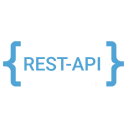

# 
Hey there I'm Sushant 👋

### 
A Web Developer 💻

## About me
- 👨🏽‍💻 I’m currently an IT Undergrad student at ADGITM, GGSIPU.
- 🌱 I'm currently exploring Web Development and Java.
- 🤔 My interest lies in Front End Development.
- 💬 Ask me about anything, I am happy to help.
- 🌏 Check out my website: https://sushantpatial.github.io/SushantPatial/
- 📫 Email me at: sushantpatial18@gmail.com
- ⚡ Fun fact: I love cooking!

## Connect with me

  
  
  
  
  

  
  
  
  
  

## Languages / Frameworks / Tools

  
  
  
  

  
  
  
  
  
  

  
  
  
  
  
  
  
  

  
  

  
  
  
  
  
  
  
  

